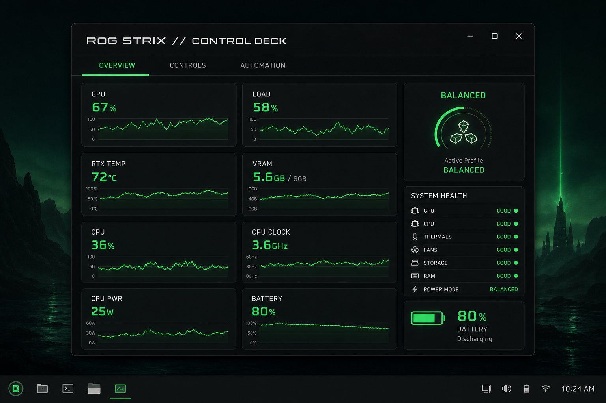

# ROG Strix Control Deck

A local-first ASUS ROG laptop dashboard for Omarchy Shell. It combines live
CPU/GPU, fan, battery, and profile telemetry with constrained controls for
ASUS performance profiles, Aura lighting, battery care, panel overdrive, GPU
modes, reusable presets, and adaptive game automation.



> [!IMPORTANT]
> This plugin is developed and tested on an ASUS ROG Strix G513IC. It uses
> runtime capability detection and should work with other supported ROG
> laptops, but ASUS hardware interfaces vary between models and generations.
> Unsupported controls are hidden where possible; your mileage may vary.

## Install

Publish this directory as the root of a Git repository, then install it with:

```bash
omarchy plugin add https://github.com/DegenApeDev/rog-strix-control.git --enable
```

For local development, copy the directory to
`~/.config/omarchy/plugins/xyz.degendev.rog-strix-control/` and enable the
plugin with:

```bash
omarchy plugin enable xyz.degendev.rog-strix-control
```

The helper is bundled inside the plugin. It does not require `sudo`, install a
system service, or start another Quickshell process.

## Requirements

- Bash, `jq`, `flock`, `pgrep`, and standard Linux sysfs
- Optional `pkexec` and `udevadm` for the explicit CPU-watts permission action
- `asusctl` with an active `asusd` service for ASUS controls
- Optional `supergfxctl` with `supergfxd` for GPU-mode switching
- Optional `nvidia-smi` for NVIDIA telemetry and active-client protection
- An ASUS laptop supported by `asus-linux` and the `asus-nb-wmi` kernel driver

Available controls are discovered at runtime. Unsupported panel overdrive,
boot sound, Aura zones, sensors, or GPU modes are hidden or reported as
unavailable.

Run the guided readiness check before enabling hardware controls:

```bash
./rog-strix-control check | jq
```

## Compatibility

| Capability | Required interface | Fallback |
|---|---|---|
| ASUS profiles and battery care | `asusctl` + `asusd` | Read-only health explanation |
| GPU modes | `supergfxctl` + `supergfxd` | Controls hidden |
| NVIDIA telemetry | `nvidia-smi` + discoverable PCI device | Runtime-power state only |
| CPU temperature/power | `k10temp` hwmon | Intel RAPL for package power |
| Battery and AC state | Any sysfs `Battery`, `Mains`, or `USB` supply | Values unavailable |
| Panel OD and boot sound | `asus-nb-wmi` attributes | Controls hidden |

### Optional CPU-watts permission

Some kernels expose the RAPL `energy_uj` counter as root-readable only. When
the counter exists but is restricted, Overview shows **Enable CPU Watts**.
Pressing it twice launches an explicit Polkit authentication flow that:

1. Installs the bundled `70-rog-strix-energy.rules` as a root-owned `0644` file.
2. Reloads udev rules.
3. Applies group `wheel` and mode `0440` to the current package counter.
4. Re-probes telemetry and reports whether access became readable.

The rule never grants write or world access. The matching **Remove CPU Watts
Rule** action deletes that exact rule and restores `root:root` mode `0400` on
the live counter. This feature is deliberately absent from normal marketplace
installation and only runs after two-click confirmation and administrator
authentication.

## Use

- Click the bar label to open the dashboard; press Escape to close it.
- Select a preset to apply its profile, keyboard brightness, panel-overdrive,
  battery-limit, and Aura settings as one rollback-protected operation.
- GPU-mode changes require a second click and may require logout or reboot.
- Integrated mode is blocked while NVIDIA compute clients are active.
- Adaptive automation supports AC/battery presets, quiet hours, thermal
  hysteresis, and exact process-name game rules.
- The Overview, Controls, and Automation views separate monitoring from
  hardware changes and policy editing.
- Automation can be paused for 15 or 60 minutes, simulated without writes,
  and explained through its bounded event timeline.

Automation runs from the plugin's headless Quickshell service entry point, so
it is independent of whether the panel is open. It stops when Omarchy Shell or
the plugin is disabled. Actions use a shared lock to prevent the UI and
automation from changing hardware concurrently.

Configuration and runtime state are stored with user-only permissions under
`$XDG_CONFIG_HOME/rog-strix-control/` (normally
`~/.config/rog-strix-control/`). The panel's export and import actions use that
same directory. Imports are validated before replacing the active config.

## Safety and privacy

The helper accepts only allowlisted actions and validates every value before
calling hardware tools. It never evaluates user input as a shell command.
Preset application restores the prior settings if an operation fails.

The copy-safe diagnostic report excludes usernames, home paths, serial
numbers, process arguments, and raw configuration paths. Plugins run
unsandboxed as the current user, so review changes before upgrading.

## Development

```bash
./test.sh
omarchy plugin validate .
qmllint -I "$OMARCHY_PATH/shell" BarWidget.qml Panel.qml Service.qml
./package.sh
```

Before release, test click, Escape, shell summon/hide, panel switching,
disable/re-enable, shell restart, import/export, and removal.

## Remove

```bash
omarchy plugin remove xyz.degendev.rog-strix-control
```

Removing the plugin does not delete the user's presets under
`~/.config/rog-strix-control/`.
